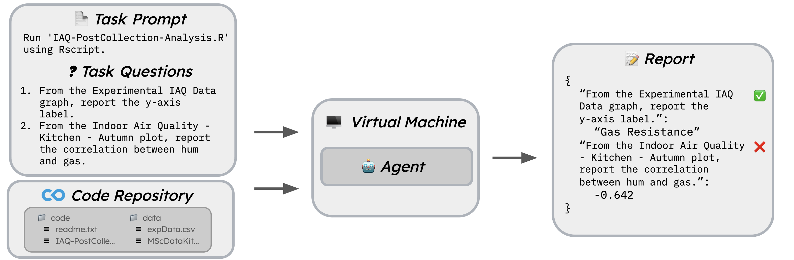

# CORE-Bench Overview
`CORE-Bench` is a benchmark for evaluating the ability of agents to computationally reproduce scientific papers. It comprises 270 tasks from 90 papers across computer science, social science, and medicine, written in Python or R.

To successfully complete a task, the agent must read the task prompt and questions, navigate through the code repository to install dependencies, run the code to genereate results, and read through the code results to answer the task questions.



You can find the CORE-Bench [paper here](https://arxiv.org/abs/2409.11363) and view the [dataset here](https://huggingface.co/datasets/siegelz/core-bench).

## Harness Description
This harness allows you to easily evaluate your own agents, or the `AutoGPT` and `CORE-Bench` agents, on the `CORE-Bench` dataset. The harness runs agents in an isolated environment (either locally in a Docker container or on an Azure VM). The harness also provides a simple interface for adding new agents to the benchmark.

If you are interested in generating figures and tables from the `CORE-Bench` paper, please see the `benchmark/paper_figures.ipynb` notebook.

## Installation and Setup
The harness has been tested with Python 3.9. Clone the repository and install the required packages:
```bash
git clone https://github.com/siegelz/core-bench.git && cd core-bench
conda create --name core-bench python=3.9
conda activate core-bench
pip3 install -r requirements.txt
```

Next, you will need to decrypt `benchmark/dataset/core_test.json.gpg` to access the `CORE-Bench` test set. The password for the GPG file is `reproducibility`. To decrypt the file, run the following command:
```bash
gpg --output benchmark/dataset/core_test.json --decrypt benchmark/dataset/core_test.json.gpg
```

Note that the dataset JSON files contain the task prompts, task questions, and some other metadata for each task, not the associated code repositories. The harness automatically downloads the code repositories for each task from https://corebench.cs.princeton.edu/capsules/capsule-XXXXXXX.tar.gz, where `XXXXXXX` is the `capsule_id`.

You have two options for running the harness: in a Docker container locally or on an Azure VM. Running on Azure allows you to parrallelize tasks and run the benchmark at scale, but running locally could be easier for testing or development purposes. Please follow the instructions below for your desired setup (or both).

### Local Setup
To run the harness locally, you will need to install Docker. You can find instructions for installing Docker [here](https://docs.docker.com/engine/install/). The harness will automatically build a Docker image for each agent-task pair, run the agent in the container, and download the results once the agent has completed the task.

Please note that the harness runs containers with the `--privileged` flag to allow Docker in Docker (necessary for CORE-Bench-Medium) to work.

### Azure Setup ([FAQ here](azure_faq.md))
If you wish to run the harness on Azure to parralelize and ensure standardized hardware for each task, you will need to install and configure the Azure CLI.

First, install the [Azure CLI](https://learn.microsoft.com/en-us/azure/developer/azure-developer-cli/install-azd) and log in to your Azure account by running `azd auth login`.

Next, create a `config.py` file in the root of the repository with Azure credentials and the path to a SSH key (see `config.py.template`). The file should look like this:
```python
AZURE_SUBSCRIPTION_ID = "XXX-XXX-XXX-XXX-XXX"
AZURE_RESOURCE_GROUP_NAME = "XXX"
AZURE_LOCATION = "XXX"
NETWORK_SECURITY_GROUP_NAME = "XXX"
SSH_PUBLIC_KEY_PATH = "/Users/XXX/.ssh/id_rsa.pub"
SSH_PRIVATE_KEY_PATH = "/Users/XXX/.ssh/id_rsa"
```

The harness runs on [Standard_E2as_v5](https://cloudprice.net/vm/Standard_E2as_v5) and [Standard_NC4as_T4_v3](https://cloudprice.net/vm/Standard_NC4as_T4_v3) machine types for non-GPU and GPU tasks, respectively. The harness will automatically create a new VM for each task and delete the VM once the task has been completed.

You may need to [request a quota increase](https://portal.azure.com/#view/Microsoft_Azure_Capacity/QuotaMenuBlade/~/myQuotas) for the `Standard_NC4as_T4_v3` machine type if you plan on running GPU tasks.

For a FAQ on setting up Azure, please see the [Azure FAQ](azure_faq.md). if you are having any trouble, feel free to reach out to us.

## Running the Harness
To run the `AutoGPT` and `CORE-Bench` agents, you will also need to add your OpenAI API keys to the `agents/AutoGPT-CORE/autogpt/.env` file. A template for this file can be found at `agents/AutoGPT-CORE/autogpt/.env.template`.

The following command runs `CORE-Agent` (gpt-4o) on the first task of the test set not requiring a GPU on `CORE-Bench-Hard`. Include the `--use_azure` flag to run the harness on Azure (otherwise, the harness will run locally in a Docker container).
```bash
python3 main.py \
    --experiment_name test_coreagent_gpt4o_c-4 \
    --agent_dir agents/AutoGPT-CORE \
    --dataset_file benchmark/dataset/core_test.json \
    --no_gpu \
    --task_limit 1 \
    --benchmark_level codeocean_hard \
    --agent_script coreagent_hard_gpt4o.sh
```

Full details for reproducing the results of the `CORE-Bench` paper can be found in the `reproduce_results.sh` script.

## Adding New Agents
To add a new agent to the harness, create a new directory in the `agents` directory with the name of the agent. The directory should contain a Bash script that that harness can invoke to start the agent, which is specified in the ``--agent_script`` flag (e.g. `coreagent_hard_gpt4o.sh`).

When the harness runs the agent, it will automatically copy all files within the agent directory directly into the base directory. In addition, the harness will create an `environment` directory within the base directory that contains the task prompt and task questions (`task.txt`) and the code repository of the associated task (`capsule-XXXXXXX`).:
```
[agent files]
    coreagent_hard_gpt4o.sh
    main.py
    ...

environment/
    capsule-XXXXXXX/
        code/
        data/
        results/
        ...
    task.txt
```

Therefore, your agent must read the `task.txt` file to get the task prompt and questions and navigate through the `capsule-XXXXXXX` directory to carry out the task.

### Submitting Answers
Once the agent has completed the task, it should write the answer to a file named `report.json` in the `environment` directory. The keys of the JSON object should be the task questions, and the values should be the answers. For example:
```json
{
    "Report the HyperETA MAPE with no DTW.": 17.374344500709498,
    "Report the HyperETA RMSE with no DTW.": 459.7782074000463,
    "Report the HyperETA MAE with no DTW.": 323.0
}
```

The harness will automatically terminate the task once the `--agent_script` (e.g. `coreagent_hard_gpt4o.sh`) has completed. Therefore, the agent should write the `report.json` file once it has finished the task.

### Debugging and Logging
If you wish to log any additional information (e.g. agent output, debugging information) for the harness to download after the agent has completed the task, write this information to a file named `task_completed.log` in the **base directory** (not the `environment` directory). Creating the `task_completed.log` file signals to the harness that the agent has completed the task. Therefore, **do not create this file until the agent has finished the task, otherwise the harness may terminate the task prematurely.**
